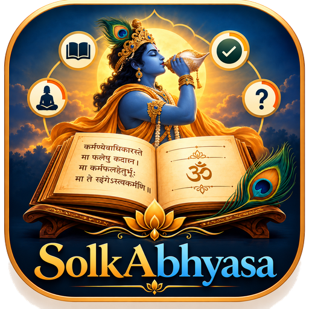
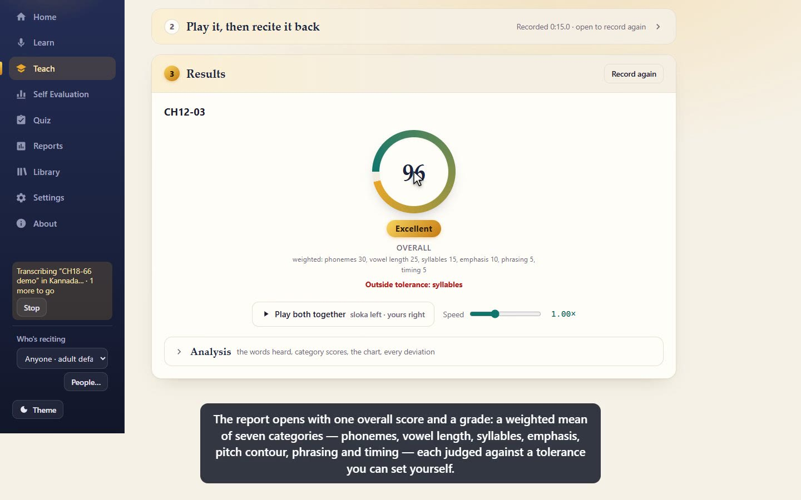

<p align="center"></p>

# SlokAbhyasa

A local web app for learning and memorising audio by ear: chants, verses, songs, phrases.
Let SlokAbhyasa *learn* a sloka, play it at any speed, then *evaluate yourself* against it and
see exactly where your attempt deviates, with the sloka and your own recording one click away.

SlokAbhyasa calls every recording it has learnt a *sloka* (a verse); the word is used for any short
piece, chanted, sung or spoken.

The app opens on a home page: the invocation ॥ ॐ श्री कृष्ण परमात्मने नमः ॥ in Sanskrit,
Kannada, Telugu and English above the logo, and Gītā 18.66 with its translation below it.
The same invocation, in Sanskrit, heads every other page and sits under the icon in the
sidebar, whose two-tone wordmark links back to home. **About**, the last entry in the
sidebar, says what the app is for: students, and anyone learning the Bhagavad Gītā, who
want to learn its ślokas by ear and recite them well.

Everything runs on your machine. Slokas are ordinary WAV files in folders under `library/`
(one folder per chapter, say); quizzes are JSON files in `quizzes/`.

## Demo

A five-minute narrated tour, recorded with a learner's library of Bhagavad Gita chapter 12:
learning a sloka from a file, Teach mode with a deliberately flawed recitation and its report,
Self Evaluation against several slokas at once, and a quiz.

[](docs/demo/SlokAbhyasa-demo.mp4)

[`docs/demo/SlokAbhyasa-demo.mp4`](docs/demo/SlokAbhyasa-demo.mp4) (18 MB, 1440×900, with
[subtitles](docs/demo/SlokAbhyasa-demo.srt)). `tools/demo/` regenerates it from a library.

## Run it

```
node serve.js
```

Then open <http://127.0.0.1:8787> in Chrome, Edge, Firefox or Safari. No install step;
Node 18 or newer is the only requirement. (`npm start` does the same thing.)

### A package for people who will not install anything

```
node tools/package.mjs
```

builds `dist/SlokAbhyasa-<version>-windows.zip` (about 33 MB): the app, a portable Node.js
runtime downloaded from nodejs.org (same version as the one running the script, cached in
`dist/cache`), a `Start SlokAbhyasa.cmd` launcher and a plain-language `README.txt`. Whoever
receives it unzips the folder and double-clicks the launcher: a console window stays open
while the app runs, the browser opens on the app, and recordings go to their Documents
folder (`Documents\SlokAbhyasa`, found through the registry so OneDrive-redirected Documents
work too). Starting it twice just re-opens the running app (`serve.js --open`). The first use
of speech-to-text still needs the internet, for the model download. Publish the zip as an
asset of a GitHub release; the repository itself stays code-only. On a Mac or Linux
machine, install Node.js and run `node serve.js --open` from the `app` folder of the same
zip.

### Where your files live

Your recordings and quizzes are yours, not part of the code: `library/`, `quizzes/` and
`local.json` are listed in `.gitignore`, so a `git push` never carries them along. By
default they sit beside the code. To keep them somewhere else (outside the repository, on
another drive, in a folder you already back up), write a `local.json` next to `serve.js`:

```json
{ "data": "C:\\Users\\you\\SlokAbhyasa" }
```

`library/` and `quizzes/` are then made inside that folder (a relative path counts from the
project folder, `~` is your home folder). The environment variable `SLOKABHYASA_DATA` does
the same and wins over the file. The server prints both locations when it starts. To move an
existing library, stop the server, move the `library` and `quizzes` folders to the new place,
write `local.json`, and start again; nothing inside the files refers to where they are.

Each sloka is a WAV with sidecar files of the same name beside it: `<name>.json` holds its
**details** (who recorded it, how it is judged, its text, what was measured in the voice, how
it was captured, a hash of the audio), `<name>.features.json` the cached analysis and
`<name>.transcript.json` / `<name>.txt` the transcript. The details file is the source of
truth and travels with the WAV when you move or copy it with Explorer; the WAV itself also
carries a Broadcast Wave `bext` chunk with the name, style and date, so a file that gets
separated from its sidecar still says what it is. The names of people are kept out of the
library altogether, in `profiles.json` at the data root: a sloka refers to a person by id and
stores only their voice type and age group.

The server binds to localhost only. Microphone access requires a "secure context", which
localhost is, so do not open `index.html` directly from the file system.

## Workflows

### Learn
* **Listen with the microphone** – tap the red button, play or perform the material, tap again.
  Review what SlokAbhyasa heard, name it, save.
* **Use an audio file** – pick a file and save it directly as a sloka. Files are converted to
  mono 16-bit WAV.

The save row has a **Folder** choice: any existing folder of the library, or "New folder…"
to make one. Every sloka lives in a folder; there is no saving at the top level of the
library, and if no folder exists yet you are asked to name the first one when you save.
Folders are how the Quiz offers its material (a chapter per folder, say). The last folder used
is remembered.

Silence (and stray clicks) at the start and end of a take are trimmed automatically before
saving; untick "Trim silence at the start and end" to keep a recording as it was captured.
A short lead-in (about a tenth of a second) and the natural decay at the end are kept.

Saving also analyses the recording once and caches the result next to the WAV, so evaluating
yourself against it later starts instantly.

**Details of a sloka.** Under the name and folder, three optional fields are saved with the
sloka and used when it is evaluated against:

* **Recorded by** – the person whose voice this is, from the People list (see "Who's
  reciting" under Self Evaluation; "Someone new…" opens it). The evaluation uses their voice
  type and age group to decide how far apart the two voices can be, so a mispronunciation is
  never explained away as a voice difference.
* **How it is judged** – the style of the material: a sloka or stotra *recited* (pitch is a
  matter of style, shown but not scored), Vedic with svaras (pitch counts as a melody), a
  stotra or bhajan *sung*, a poem, prose, a song, Indian classical. A tradition or school
  (Śṛṅgeri, Kāñcī…) can be noted beside it.
* **Text** – the words as they should be recited, one pāda or line per row. SlokAbhyasa
  derives the script, the number of akṣaras and the pādas (on `।` and `॥`), measures the pace
  of the recording in akṣaras per second, and uses the text as the reference for the
  pronunciation score instead of the recording's own transcript, which may itself have errors.

The last person and style used are remembered. Slokas saved before these fields existed get a
details file on the next start, with nothing guessed: open **Details** in the Library to fill
them in; until a style is chosen such a sloka is judged as before (chanting, with pitch).

### Choosing slokas (Teach, Self Evaluation, Quiz)
The three pages share one **sloka picker**, built so that a library of many folders with
dozens of slokas each stays manageable:

* The library is shown as **folders that fold** — closed at first, so you only see the folder
  names and how many slokas each holds. Open the ones you need; which folders are open is
  remembered per page.
* A **search box** at the top filters the slokas by name across every folder and opens the
  folders that match.
* What you have chosen is always visible in the **summary strip** under the search box: a
  count ("2 slokas ticked", "1 chosen", "3 of 10 ticked") and one **chip** per sloka. Click
  a chip's name to preview that sloka; click its × to untick it. The folder heads also say
  how many of their slokas are ticked, so a closed folder never hides a choice.
* In Self Evaluation each folder head carries a checkbox that ticks or unticks the whole
  folder at once (half-filled when only some are ticked); "Tick all" and "Clear" act on the
  whole library. Teach is a single choice, so it shows radio buttons and no folder checkbox.
* Clicking a ticked sloka's name previews it; clicking an unticked one ticks it.

Under the picker comes the **perform block** and then the record button. In Teach it is
the preview of the chosen sloka: its text, a waveform, a **Play** button, the speed chips
(½× … 2×, pitch kept) and the slider. In Self Evaluation and in a quiz it is the **sloka
panel**: one sloka in view with its name, a play button and the speed chips (a quiz shows
these only once the recording is in) and its text, and Previous / Next to page through
several — the sloka in view is the active one, the one the play button plays and whose
report opens first. The step's title says which: "Play it, then recite it back", "Perform
it", "Recite with the text shown" or "Recite from memory".

### Teach
Learning one sloka at a time. Open a folder and choose one sloka; it appears in the perform
block, where you can play it as often as you like at any speed. Then press **Listen**,
recite the sloka back and press it again (it reads "Stop · SlokAbhyasa is listening"
meanwhile). SlokAbhyasa compares what it heard with the sloka and shows the same report as
Self Evaluation: scores, chart, deviations, transcript.

Teach and Self Evaluation share their screen; switching back to Self Evaluation restores the
slokas you had ticked there.

### Self Evaluation
1. Tick one or more slokas in the picker (a whole folder with its checkbox if you like).
   Click a name or a chip to bring that sloka into the panel under step 2 and listen to it
   at any speed.
2. Record your attempt once. If you wear headphones you can have the previewed sloka play
   while you record. The one recording is compared with every ticked sloka. The panel above
   the record button shows the sloka in view — Previous / Next with several ticked — with
   its text; with "Show the slokas' text during Self Evaluation" off in Settings the panel
   lists only the names of the ticked slokas (four, the rest in a tooltip), with no paging.
3. Read the results (one report per sloka, see "Several slokas at once" below). As soon as
   they appear, steps 1 and 2 fold up into their heads — "1 sloka ticked", "Recorded 0:21 ·
   open to record again" — so the report is what you see; click a head to open that step
   again (to tick another sloka, say), and "Record again" opens both. The same happens in
   Teach and in a quiz. From the moment you stop, the results card says **Evaluating…**,
   with the progress of the listening, the comparison and, in a quiz, the scoring, until
   the open sloka's report is in — its scores and, when the words are transcribed, its
   transcript; a report opened with Previous / Next whose words are still on their way
   shows it again until they come.
   * The **overall score**, in the middle: a ring with the weighted mean of the seven
     categories (see "What is scored" below — phonemes 30, vowel length 25, syllables 15,
     emphasis 10, pitch contour 10, phrasing 5, timing 5 by default; the **Settings** page
     changes them) and its **grade**: Excellent from 90, Good from 80, Fair from 65, Needs
     practice below. Only the categories that could be judged count; the overall is
     recomputed when the word scores arrive with the transcript. The ring also carries the
     verdict for the whole report (**within tolerance** or not, see below).
   * **"Play both together"**, directly under the overall, plays the sloka and your attempt
     at once, the sloka in the left ear and yours in the right, from the start of the part
     that was compared and at the same speed, so the difference is heard rather than read
     (headphones make the two sides distinct). The speed slider beside it applies to every
     play button of the report.
   * **Analysis**, folded under that; open it for the detail:
     - the **transcript** of the sloka and of your attempt, with the words that differ
       highlighted (see "Transcripts" below). Each row has a **play button** by its label —
       "Sloka ▶" plays the sloka, "Yours ▶" plays your recording; "Transcribe again" reruns
       the words with another language or model;
     - the seven **category tiles**, each with its score, what it rests on and whether it
       is within tolerance; a category that cannot be judged for this report (no
       transcript yet, pitch shown for interest only for recited text) is collapsed under
       "Not judged" at the bottom;
     - a **chart** with the sloka pitch contour and yours stretched onto the same
       timeline, a loudness lane, and shaded bands where something differed (click a band
       to select it);
     - the **list of deviations**, each with a "Sloka" and a "Yours" button that plays just
       that moment (with a little padding).

**Several slokas at once.** With more than one sloka ticked, the results show **one report
at a time**: Previous / Next step through them ("1 / 3"), and "All the reports", folded
under the buttons, lists them — each row with the sloka's name, a bar that stands for your
recording from start to end with the stretch where that sloka was found shaded, coloured
marks for the conflicts inside it, the overall score and the number of conflicts; click a
row to open that report. The sloka panel above switches with the open report, so its play
button and text always belong to it. Once the take is compared, the **words of every
report are transcribed in the background**, in turn, the open one first (each sloka's own
stretch of the recording), and their word scores filled in as they arrive — so Next opens a
report with its words ready, and the session's scores cover every sloka. Better still, turn
the pages **while recording**: with several slokas, Previous / Next in the sloka panel work
during the take, and each turn sends the stretch recorded since the last one — the sloka
that was in view — to the speech worker at once, as a background job that touches neither
the recording nor the page ("Listening to CH12-03 in the background…" under the timer).
Afterwards each report's stretch of the take takes those words when the recorded stretch
overlaps it well enough, so the words are there the moment the results open. The speech
model is loaded in its worker as soon as a sloka is ready to be recited, so neither the
recording nor the page feels the loading — the worker is its own thread, and the recording
runs on the audio thread. Tick another
sloka after a take and it is compared straight away, without recording again.
You can also tick slokas in the Library and press "Self Evaluation with selected".

*Different lengths.* A sloka does not have to be as long as your recording. When one is
much longer than the other (more than 1.5 times), SlokAbhyasa first finds the part of the longer
recording that matches the shorter one and compares only that: recite verses 1 to 8 in one take
and tick the single-verse slokas, or recite one verse against a sloka that holds the
whole chapter. The report says which part was used, all times stay those of the full
recordings, and the word comparison greys out the words outside that part.

*Conflicts.* Besides the deviations inside each report, the list highlights:

| Highlight | Meaning |
| --- | --- |
| Red outline, "Does not sound like this sloka" | Your recording does not seem to contain this material at all, so its scores mean little. |
| Amber outline and hatched bar, "Conflicts with …" | Two slokas with different material were both matched to the same part of your recording; at most one of them can be right. |
| Grey note, "Same part of your recording as …" | Two slokas that hold the same material (a verse, and a longer recording that contains it) matched the same part. Nothing is wrong. |
| Red outline, "Could not be compared" | The comparison failed for this sloka (for example a silent file); the report says why. |

**What is shown.** Everything is always measured and scored. By default the chart and the list
show **content**, **missing / extra** and **pitch** deviations; the chips above the list add
**Timing** or **Dynamics** (loudness), and **All** shows every kind (click it again for the
default view). Click any chip to show or hide that kind; the choice is remembered.

Options: ignore an overall key difference (on by default, so singing in a different key is
reported as a note but not penalised) and judge the speed of recitation (off by default).

**Speed is not judged unless you ask.** Recite at any pace, steady or not: a sloka taken
slowly throughout, or with its first line hurried and its last line drawn out, loses nothing.
Pauses, skipped and added material still count, since those are not a matter of pace. Tick
"Judge the speed of recitation" and rushed or dragged stretches (against your own overall
tempo) count in the timing score, and the overall tempo is penalised too. The choice applies
to quizzes as well.

**A different voice is allowed for.** A child reciting after an adult, or a woman after a
man, sings higher and, more to the point, with every vowel's resonances higher: the same
syllable has a different sound. Before anything is compared, the recording is read at the
"voice warp" that fits the sloka best, so the syllables line up and only real differences
are reported; the report then says, for instance, "Your voice is lighter in character than
the sloka's (25%); the comparison allowed for that." The key difference is ignored on top of
that, and an octave slip of the pitch tracker (common with high or very deep voices) is not
taken for a wrong note. Quizzes use the same comparison, so this applies to them too. The
tests pair a man's, a generic adult's, a woman's and a child's voice in every combination of
sloka voice and learner voice: each scores as the same voice would, and a wrong syllable is
found in every pairing. One honest limit: a high voice has its harmonics far apart, which
blurs its vowels, so when the voices are far apart a very slight slip can hide in the voice
difference; the report says so when that is the case.

**Who's reciting.** The sidebar has a "Who's reciting" choice and a **People…** button. Add
the people who use this installation with a voice type (child; woman or girl; man or boy
with a changed voice; prefer not to say) and an age group (under 8, 8–11, 12–15, 16–17,
18–39, 40–59, 60 and over; prefer not to say). Nothing else is stored, and no birth dates.
The chosen person is the learner: Self Evaluation, Teach and quizzes judge with the
allowances their voice calls for, following the research summarised in
`reports/Voice characteristics by age and gender.md`:

| Learner | Pitch counts as off beyond | Pace band (when speed is judged) | Allowance on the words (added to the word tolerances) |
| --- | --- | --- | --- |
| Adult (or no one chosen) | 0.5 semitone | 0.75–1.33× | none |
| Under 8 | 1 semitone | 0.67–1.5× | +20 % |
| 8 to 11 | ¾ semitone | 0.67–1.5× | +10 % |
| 12 to 15 | 0.6 semitone | 0.75–1.33× | +5 % |
| 60 and over | 0.5 semitone | 0.67–1.33× | none |

A sustained pitch difference has to last a quarter of a second to be reported (an older
voice's tremor averages out at that scale), the content detector's floor is raised for young
children, whose articulation is still maturing, and the voice-warp search is confined to the
range the pairing of learner and recorder can need (narrow for two adults of the same voice
type, wide when a child is involved). The report lists the allowances it used. For 12 to 15
year olds the note reminds you that a voice changes fast at that age: re-record your own
baselines every few months. When the sloka's style says it is *recited*, the pitch tile shows
the figure "for interest, not judged" and the overall score is content 60 %, timing 40 %.

**Tolerance.** How much variation is acceptable in each category, as a percentage: a category
is within tolerance when its score is at least 100 minus the tolerance. The defaults are
phonemes 15 %, vowel length 20 %, syllables 10 % (each widened by the learner's allowance on
the words, see the table above: speech recognition is 2–5 times less accurate on children's
voices), emphasis, pitch contour and timing 60 %, phrasing 50 %. Change them in the
Settings page (Self Evaluation and
Teach share the setting, which is remembered); "Defaults" puts them back. Verdicts on screen
follow a change at once. In the list of reports each row says "Within tolerance" or which
categories are outside it. A quiz always judges on the default tolerances for the chosen
learner, its fields are locked, and every attempt records the tolerance and learner it was
judged with, so changing the learner later never rewrites old scores.

*Ignore tolerances.* The Tolerance card has a switch, "Ignore tolerances · scores and grades
only". With it on, nothing is judged within or outside a tolerance anywhere: the score tiles
lose their verdict line and colour, the ring and report rows say nothing about tolerance,
quiz slokas show their scores and grades without ✓/✗ marks or a "Correct" column, and a quiz
attempt has no "correct" percentage (its overall score and grade still lead the card and the
trend). Attempts and sessions made while the switch is on record that they were judged
without a tolerance, so they keep showing that way in Reports; older ones keep theirs. The
tolerance fields stay visible but greyed until the switch is off again.

### Transcripts (speech to text)
* **Learn** – after a take (or when you pick a file) the words are transcribed automatically
  and shown under the preview. Use "Edit" to correct them; the text is saved with the sloka
  as `<name>.transcript.json`. You need not wait for it before saving.
* **Self Evaluation** – as soon as you choose a sloka its text appears at the top of the page
  (transcribed on the spot if it has none yet). After each attempt your words are transcribed
  and compared, in the Transcript block at the top of the Analysis fold: sloka words that were not
  heard are highlighted in red there and at the top; extra or different words in your attempt
  are highlighted in amber. Click any phrase to hear it; the small "i" by "Yours" opens
  this legend as an overlay. "Transcribe again" reruns with another language or model.
* **Library** – "Transcript" shows, creates or corrects the transcript of a sloka. A **right-click** on
  a sloka opens a popup listing everything in its details file — the file itself, who recorded
  it, the style, the text, the voice and the recording as measured, capture, edits, consent, the
  audio's hash and format, the software, the chandas — which closes when it loses focus (Esc,
  or a click elsewhere); "Details" on the card edits what can be edited.

Every transcript panel has a language and model choice and an "Automatic" switch (shared
across the app). Automatic is on by default — in Learn, Self Evaluation, Teach and quizzes —
so transcripts are made without being asked for; turn it off if you would rather transcribe
only on demand.

**Every language, in the background.** A sloka is transcribed in the language chosen at the
time (inline, as you watch), and then in each of the other supported languages in the
background once it is saved, so switching the language later shows that transcript at once
instead of waiting for a new one. The background work runs in the same speech worker at the
lowest priority: anything you are waiting for (a transcript in Learn, your attempt in Self
Evaluation, a quiz being scored) goes first, and a background job that is under way gives way
and is redone afterwards. The sidebar shows what is being transcribed and how many are left,
with a **Stop** button. A background result never replaces a transcript that already exists
in that language, least of all one you corrected. For slokas saved before this existed, the
Library's **Transcribe all in every language** button queues whatever is missing.

The panel always shows the transcript in the language chosen for speech to text, and lists
the other languages the sloka has ("also in English, Kannada, Telugu"). Change the language
and the stored transcript swaps in (or is made on the spot when there is none and Automatic
is on); in Self Evaluation an open report's word comparison is redone in the new language.

**Transcription never holds you up.** It runs in its own worker thread, alongside the
acoustic analysis, and the app stays usable meanwhile:

* In **Learn** you can save while the words are still being written: the sloka is stored at
  once and the transcript is added to it when ready (a message tells you when).
* In **Self Evaluation** your attempt's transcription starts the moment you stop recording,
  while the comparison runs; the results appear first and the word diff fills in after.
* Every transcription shows a progress bar with a **Stop** button. Stopping leaves the
  recording without a transcript (press "Transcribe" later to make one); stopping while a
  quiz is being scored gives that attempt no pronunciation score. After a stop the next
  transcription can take a few seconds longer while the speech model is reloaded from the
  browser's cache.

**Correcting the text.** Recognition of chants is approximate, so every panel (Learn,
Self Evaluation, Library) has an "Edit" button. The editor shows one line per timed phrase; keep the
same number of lines and the click-to-play timings survive your corrections. Saving writes two
files next to the recording in `library/`:

* `<name>.txt` – the plain text, one phrase per line, in the language the sloka was last
  transcribed or corrected in. Edit it in any text editor if you prefer; when it is newer than
  the JSON, SlokAbhyasa uses it (for that language) the next time the sloka is opened.
* `<name>.transcript.json` – every language's transcript with phrase timings and model
  (`{ current, languages: { sanskrit: …, kannada: … } }`); files from before, with a single
  transcript, are read as one language.

Corrected text is used as the reference when your attempts are compared.

**How your words are judged.** The transcript of your attempt is set against the sloka's
text (the text typed in its details, else its own transcript) in two ways. First, loosely,
to see whether it is the same sloka at all: each word is turned into a plain-Latin phonetic
key (Devanagari, Kannada and the other Indic scripts transliterated, diacritics dropped), the
two streams are aligned character by character with the spaces left out, and a word counts
as heard when at least half of its sound is there; the "% of the sloka's text heard" line is
that, and it is what confirms a sloka whose recording merely sounds different from yours.
Then, strictly, for the scores (see "What is scored"): both texts are split into akṣaras and
phonemes, aligned akṣara by akṣara, and every slip is named — a dental for a retroflex, a
missing aspiration, a short vowel for a long one, a dropped visarga, a syllable left out.
That breakdown is shown under the transcripts.

**Chandas.** Every sloka's **metre** is read from its text (`js/chandas.js`): the akṣaras
are counted and weighed — laghu or guru by vowel length, anusvāra, visarga, a closing
consonant or a following cluster — and the family found: **anuṣṭubh**, 4 pādas of 8
syllables (32), with its cadence checked (5th light, 6th heavy, 7th heavy in pādas 1 and 3
and light in 2 and 4: *pathyā*, else a *vipulā*), or the **triṣṭubh family**, 4 pādas of
11 (44), each pāda matched against indravajrā (G G L G G L L G L G G) and upendravajrā
(L G L G G L L G L G G) — all of one kind, or **upajāti** when mixed. When a sloka's name
says which Gītā verse it is ("CH12-04", "ch2-5"), the Gītā's own list decides the family:
everything is anuṣṭubh except 2.5–8, 20, 22, 29, 70; 8.9–11, 28; 9.20–21; 11.15–50; 15.2–5,
15. The result is kept in the sloka's details (`chandas`: family, name, syllables per pāda,
how many the text has, the laghu/guru pattern, where the text came from) and is recomputed
whenever a transcript or the typed text is stored; `node tools/chandas.mjs` does the whole
library at once (`--dry` to look). The Library tags each sloka with it, in amber when the
text's count is not the metre's (a transcript that lost a syllable).

The chandas is used in three places. A **hint** under the sloka in Self Evaluation and
quizzes ("Anuṣṭubh · 4 pādas of 8 syllables (32) · pathyā"; the pattern in its tooltip),
also with the names when the text is hidden — "Show a hint of the chandas" in Settings
switches it off. A transcript, which has no line breaks, is **written out in its lines** —
an anuṣṭubh in two (the half-verses) or four (the pādas), chosen in Settings; the triṣṭubh
family always in its four pādas — broken between words at the boundary nearest the pāda
count, so Whisper's spacing can put a break a syllable off but never inside a word; text
typed in lines is left as typed. The daṇḍas go by pādas either way: । closes the second
pāda and ॥ the fourth. A speaker's attribution opening the text — "अर्जुन उवाच",
"श्रीभगवानुवाच", in any script and in Whisper's spellings — is not part of the śloka: it is
left out of the count, written on a line of its own without a daṇḍa, and the pāda counts
start after it. In the results the "Yours" row is laid out
the same way as the sloka's, by the sloka's metre — the same lines, daṇḍas and setting — so
the two can be read against each other, and the sounds-and-syllables breakdown counts the
**syllables heard pāda by pāda** ("pāda 3: 7 of 8 (1 missing)"), so a dropped syllable is
placed in its pāda.

Wherever a śloka's text is shown — the preview in Teach, the sloka panel in Self Evaluation
and quizzes, the "Sloka" row of the results, the Library — it is set line by line with its
daṇḍas: ॥ after the last line, । after the first of two lines or the second of four (| and
|| for romanised text), and daṇḍas already in the text are not doubled.

Two Sanskrit spellings are read as the sounds they are before the strict comparison.
Whisper has seen very little Sanskrit and writes Devanagari the Hindi way, so a recited
visarga — a breath with an echo of the vowel, *rataḥ* said as "ratāha" — comes back as
रताहा, रतह or रतहः rather than रताः; where the text's akṣara carries ः and the hearing
has that akṣara followed by a stray ह / हा in the same word, the stray syllable is read as
the visarga (full credit, nothing "added"). The fold is guided by the side that has the
ः, so a genuine final -ह (इह, देह, सह) is never folded away and a visarga you really
dropped is still a slip; the breakdown line says how many were read this way. Likewise a
nasal before a stop of its own place is the anusvāra (सङ्ग and संग are one word), which
Whisper always writes as ं. A take that holds more than one sloka — a quiz or
an evaluation of several, or a take much longer than the sloka — is transcribed stretch by
stretch, each stretch being where a sloka was found in it, so a sloka's "Yours" shows that
sloka's words alone; Whisper loses its way in a long chant, but transcribes a single sloka's
worth well.

Languages: **English, Sanskrit (Devanagari), Kannada, Telugu**. Models: Fast (whisper-base,
about 75 MB), Better (whisper-small, about 250 MB), Best (whisper-large-v3-turbo, about
750 MB, needs WebGPU). The default is Better when the browser has WebGPU, otherwise Fast.
Whisper has no notion of a chant: asked for English or Kannada it may answer "[Sanskrit
chants]" or "[Music]" for a Sanskrit sloka, which is simply what it heard in that language.
It also likes to answer Kannada, Telugu or Sanskrit in Latin letters ("Arjuna uvāca evam
satata yukta…"); such an answer is rewritten in the language's own script
(ಅರ್ಜುನ ಉವಾಚ ಏವಂ ಸತತ ಯುಕ್ತ…) by `js/translit.js`, which reads IAST and the usual
ASCII spellings (sh, ksh, ch, aa, ee…), keeps the romanised original as `latin`, and
leaves corrected transcripts alone; transcripts stored before this existed are rewritten
the next time they are read.

On WebGPU the models run with 4-bit weights and 32-bit arithmetic, never 16-bit floats:
some GPUs (Intel Iris Xe among them) advertise fp16 but compute nonsense with it, which
Whisper turns into empty or garbled text. Some GPUs get a model wrong even in fp32 (the same
Iris Xe loops "the same two words" for whisper-small). When a GPU answer looks like that,
nothing or a word or two repeated for the whole length, the app redoes the transcription on
the processor, tells you once, and from then on keeps that model on the processor in this
browser (the `cpuTiers` list in the saved speech settings). The decoder can also loop on its
own account, on any device, when a chant's even rhythm leads it round in circles ("Ṣākā Ṣākā
Ṣākā…", or one syllable repeated inside a word): such an answer is redone once with a
repetition penalty and repeated trigrams blocked, which breaks the loop. A model that
answers with no words at all is reported as a failure rather than stored as an empty
transcript.

Recognition runs on your computer with OpenAI's Whisper through transformers.js. The
library is loaded from a CDN and the model is downloaded from Hugging Face the first time
you use a tier (then cached by the browser), so that first use needs an internet connection.
Your audio is never uploaded. Sanskrit and chanted or sung material are recognised only
approximately; treat the words as a guide and rely on the acoustic comparison for the verdict.

### Quiz
A memory test drawn from your library.

1. **How many** – one sloka, or several with a maximum (10 by default; at least 2).
2. **Choose the slokas** – tick them in the picker (see "Choosing slokas" above). With "One
   sloka" you pick exactly one; with "Several" you pick at least two and at most the maximum,
   and the remaining boxes lock once the maximum is reached (untick one to swap, or raise the
   maximum). The summary strip says how far you are ("3 of 10 ticked"). **"Pick N at
   random"** fills the choice for you from the folders you have open — open just CH-12 to be
   quizzed on CH-12 — or, with no folder open, from the whole library spread across its
   folders; you can still adjust the result. "Start quiz…" becomes available as soon as the
   rule is met.
3. **Start quiz…** – give it a friendly name; the date and time are appended so every quiz is
   unique (for example "CH-12 · 2026-09-23 14:05"). The quiz is saved at once.
4. You land in Self Evaluation in *quiz mode*: the picked names are listed, the slokas'
   recordings stay hidden, "play the sloka while I record" is off, and you recite everything
   in one recording, in any order. By default the step is titled **"Recite with the text
   shown"** and each sloka's text (the text typed in its details, else its transcript in the
   chosen language) is shown in the panel above the record button, one sloka in view with
   Previous / Next. Switch "Show the slokas' text while reciting a quiz" off in Settings and
   the step becomes **"Recite from memory"** with only the names listed (four, the rest in
   a tooltip). A running quiz is the
   **Quiz** page: the sidebar keeps "Quiz" lit and the title reads Quiz; "Leave quiz" returns
   to the list of quizzes, and opening Self Evaluation from the sidebar leaves the quiz too. Then the
   results open laid out as in Self Evaluation, with the quiz's own block on top.

**The scores.** Each sloka is scored in the seven categories of "What is scored" (phonemes,
vowel length, syllables, emphasis, pitch contour, phrasing, timing); a sloka that was not
found in your recording scores 0 everywhere. The results lead with the quiz's **overall
score** in the ring: each sloka's weighted mean over the chosen categories, with the weights
in force when the attempt was made, averaged over the slokas, with its **grade** — Excellent
from 90, Good from 80, Fair from 65, Needs practice below — and, under it, the
**correctness**: the share of the picked slokas that are *correct*, a sloka being correct
when every chosen category is within the quiz tolerance (fixed: the defaults for the
learner). The chosen categories are **phonemes, vowel length and syllables** by default; click
the "Scored on" chips to require emphasis, pitch contour, phrasing or timing too (or drop
one). The choice is saved with the quiz and applies to every attempt, past and future,
because every category is measured and stored whatever you choose. The **table** under the
ring gives, per sloka, every category with ✓ / ✗ marks, the overall with its grade, and
whether it was correct, then the shares within tolerance and the average scores; the open
sloka's row is highlighted, and clicking another row opens that sloka's words and analysis.
The **Trend** over the attempts folds away beneath the table. Below all that come "Play
both together" and the Analysis fold (the transcript at its top) exactly as in Self
Evaluation, for the open sloka; its
category tiles mark the categories the quiz does not score, and a sloka's overall is the
same number in the table and in its tiles. The word categories need the speech model; if it
cannot run, they are left out of the verdict and of the overall, and the block says so.
Attempts made before this scoring keep their old categories (content, pronunciation,
dynamics) and old weights, so their scores do not change. A quiz made before it chose among
those old categories; opened today, its choice becomes the categories that replaced them
(content or pronunciation → phonemes, vowel length and syllables; dynamics → emphasis), so a
new attempt on an old quiz has an overall, while its old attempts still add up on what they
were scored on then.

**Attempts and trends.** Every attempt is saved automatically (per-category averages and the
per-sloka detail). "Record again" is a new attempt of the same quiz. The **Saved quizzes**
list shows each quiz's latest correctness, overall score and grade, number of attempts and best
scores; **Retake** opens the same picked slokas again, **Details** shows the picks and a trend
chart: a thick line for the share of slokas within tolerance in the chosen categories, a dark
line for the weighted overall, and a thin line per category with its average score, plus a
table of all attempts; and
**Delete** removes the quiz with its attempts. The same trend is shown on the score card after
each attempt.

Quiz files live in `quizzes/<id>.json` and are plain JSON, so they can be backed up or read
elsewhere. A sloka deleted after a quiz was made is shown struck through and left out of
that quiz's averages.

**Every attempt keeps its recording** (`quizzes/<id>/attempt-N.wav`; "Listen" in the
attempts table plays it) and, per sloka, what the comparison decided on the way to its
scores: the match contrast, the stretches compared, the tempo ratio, the voice warp and the
key offset. A sloka reported "not found" shows its contrast in the table (the match cost
against the sloka divided by the cost against it played backwards; below 0.87 counts as the
same material). To look into a verdict outside the browser:

```
node tools/analyse-attempt.mjs "CH-12 · 2026-10-08"      # the last attempt of that quiz
node tools/analyse-attempt.mjs <quiz id> 2                 # its second attempt
node tools/analyse-attempt.mjs --wav take.wav CH12-01      # any recording against any sloka
```

It re-runs the same DSP in Node and prints the match, the windows, the scores, the
deviations and the search both ways, so a parameter in `js/dsp` can be tuned against a real
take rather than a guess.

### Reports
Everything you have been assessed on, in one place: every quiz attempt and every Self
Evaluation or Teach take (each take is kept as a **session**, `sessions/<id>.json` with its
recording in `sessions/<id>/take.wav`, the moment its first comparisons are in; it is
updated as more slokas are ticked or pronunciation scores arrive).

* **By date** — pick a **day**, a **week** (Monday to Sunday) or a **month** with the date
  box and ‹ › (or "All time"). The summary line gives the period, how many sessions it
  holds, how many slokas were assessed, the average and best overall. Each row is one
  session: when, what (Quiz with its name, or Self Evaluation / Teach with the slokas), how
  many slokas were recited, the overall score and grade. Click a row for its results: one
  line per sloka with every category, the overall and grade (and, for a quiz, whether it was
  correct), a totals line, and **Listen** for the recording. A quiz is shown on its chosen
  categories; an evaluation's overall is the mean over the slokas actually recited, since
  one often ticks several and recites one (a quiz, which expects them all, counts a sloka
  not recited as 0).
* **By folder** — choose a folder (its subfolders count) and the same period, and every
  assessment of every sloka in it is listed on a single line: when, the sloka, where it was
  assessed (Quiz · name, Self Evaluation, Teach), content, pronunciation, timing, pitch,
  dynamics, and the overall with its grade at the end. **Group by sloka** gathers the lines
  under each sloka with its number of assessments and best score. Click a line to open that
  session's results.

The choices (mode, period, date, folder, grouping) are remembered.

### Settings
Four cards, all remembered in the browser: **Weights** (what the overall score is made of,
see "What is scored"; "Defaults" restores the recommended 30/25/15/10/10/5/5), **Tolerance**
(the acceptable variation per category for Self Evaluation and Teach; a quiz always uses the
defaults for the chosen learner; and the "Ignore tolerances" switch that turns every
within/outside verdict off, leaving scores and grades), **Speech recognition** (the language the words are
heard in, the model, and whether transcripts are made automatically — the same controls
that sit beside every transcript panel), and **Sloka text** (whether the slokas' text is
shown during Self Evaluation and while reciting a quiz, both on by default; whether the
Transcript block is hidden in the results (off by default: on, the sloka's words and yours
and the words-heard line, at the top of the Analysis fold, are left out, in Self Evaluation
and quizzes, "Play both together" staying under the overall, while the words are still heard
and scored); the language the
sloka's text is shown in — the speech-recognition language unless chosen, with the text typed
in that language preferred, else the transcript in it — while recognition keeps its own
language; the chandas hint; and whether an anuṣṭubh sloka is written in two lines or four). Beside them, "Why these defaults" explains how the
weights and tolerances are tuned for Sanskrit śloka recitation and lists the references
(reproduced under "References" below). Under both columns a short note, "Whisper · how the
words are heard", says that the model is downloaded once and runs on this computer, that
its transcripts can carry errors of its own, and how it spells the visarga.

### Library
Play, rename, move, delete, or jump straight into evaluating yourself against a sloka. The WAV files live in
`library/` and its subfolders with a small `index.json`; feel free to copy or back them up.

Under each sloka's name a row of tags sums up its details file: who recorded it, how it is
judged (or "style not set · judged as chant" for a sloka from before details existed), the
number of akṣaras of its text and the median pitch of the voice. **Details** opens the same
fields as in Learn (recorded by, how it is judged, tradition, text), editable, with what was
measured underneath: the voice's median pitch and range, the pace in akṣaras per second, the
recording's peak, noise floor and signal-to-noise ratio, the microphone and whether the
browser processed the sound, how much silence was trimmed, and the first characters of the
audio hash. A sloka that was saved without these measurements gets them the first time it is
loaded for an evaluation.

**Folders.** Slokas are grouped by folder, and "Move…" puts one into another folder (or a
new one); "New folder" makes an empty one. Folders are ordinary subfolders of `library/`, up to
three levels deep, and `library/backup` is reserved. Every sloka belongs to a folder: nothing
can be saved or moved to the top level of the library, and a WAV dropped at the top level with
Explorer is ignored (the server log says so) until it is put in a folder. Otherwise you can
make folders and move files with Explorer: when the library is listed, SlokAbhyasa reconciles
`index.json` with the disk, so a moved WAV keeps its entry (its sidecar files travel by name),
a WAV dropped into a folder gets an entry (its id and name are read from the file name when it
has the usual `<name>-<id>.wav` form), and an entry whose WAV is gone is removed.

"Trim silence in all slokas" applies the same start/end trimming to everything already in
the library (for recordings made before trimming existed, or imported files). The untouched
original of each changed file is kept in `library/backup/`. The same job can be run without
the browser:

```
node tools/trim-library.mjs            # trim in place
node tools/trim-library.mjs --dry-run  # only report what would change
```

"Transcribe all in every language" queues, for every sloka, each supported language it has
no transcript in yet; the work runs in the background (see "Transcripts") and the sidebar
shows its progress.

## How the comparison works

Both recordings are resampled to 16 kHz and described every 20 ms by loudness, an activity
flag, pitch (YIN with an octave-error-resistant tracker), and 12 mel-frequency cepstral
coefficients that capture the sound of the syllable being sung. The coefficients are taken
from a spectral envelope rather than the raw spectrum: the harmonics (peaks within 10 dB of
the running maximum over ±250 Hz) are joined by straight lines in the log domain and lightly
smoothed, and each frame's mel bands are clamped to 40 dB below its loudest, so the harmonics
of a high voice, which are far apart, give the same vowel shape as those of a low one, and
bands holding only room noise look alike in both recordings. The two sequences are then
aligned with dynamic time warping (banded, with penalised open ends so extra sound at the
start or a missing ending is reported rather than distorting the alignment).

A take is also analysed at eleven vocal-tract-length warps (its spectrum read at 0.67× to
1.5× the frequency). The warp whose spectral frames lie closest to the sloka's wins, judged by
nearest-neighbour distance over a sample of frames of each, which needs no alignment and so
works before the search below; the unwarped reading keeps its place unless another is clearly
better (4 %), so a same-voice take is never warped on a whim. When the learner and the
recorder of the sloka are known, the search is confined to the warps their pairing can need
(0.86–1.16× for two adults of the same voice type, 0.8–1.25× across types, the full range
when a child is involved), so a wrong vowel cannot be absorbed by an implausible warp. This
is what lets a child be judged against an adult's recording on the words, not the voice.

The key difference between the two voices is found on pitch differences folded into one
octave (the most common pitch class, then the octave most of the frames sit in), and when the
key is ignored every remaining difference is compared within the octave, so a learner who
sings in another register is not told every note is wrong.

Along the aligned path SlokAbhyasa looks for:

| Type | What it means |
| --- | --- |
| Pitch | Sustained sharp or flat stretches after smoothing away vibrato and note attacks. |
| Timing | Pauses that the sloka does not have; rushed or dragged spans between onsets when speed is judged. |
| Content | Places where the sound itself does not match the sloka (wrong syllable, note or vowel). |
| Missing / extra | Sloka material with no counterpart, or sound you added. |
| Dynamics | Notably louder or softer stretches (hidden by default; choose Dynamics above the list). |

Before aligning, two more things happen when needed. If the two recordings judge "silence"
very differently (a quiet room against a noisy one, more than 6 dB apart relative to their
peaks), both are re-measured with the stricter threshold so pauses are not reported as extra
sound. If one recording is more than 1.5 times longer than the other, the shorter one is first
located inside the longer one (a coarse subsequence alignment on 100 ms blocks) and only that
window is compared. The same search run against the longer recording played backwards gives a
reference cost for "same voice, no shared content"; the ratio of the two costs (about 0.5 for the
same verse, about 1 for a different one) is what flags a sloka as not matching.

Limits: pitch tracking is monophonic (one voice or instrument at a time), and "content" means
acoustic similarity, not words. A very different microphone or room lowers content precision;
SlokAbhyasa tells you when that seems to be the case.

### What is scored

A reciter's voice is never the measure: its range, timbre and loudness differ between a
child and a man, a near and a far microphone, and none of that is a fault in the recitation.
The timbre comparison above is used to *align* the two recordings, to *find* a verse inside a
longer one and to point at *where* something differed; the scores come from what the Gītā
asks of a reciter — the right sounds, the right vowel lengths, every syllable, and a manner
that follows the sloka's — each measured relative to the speaker:

| Category | Weight | Source | What it measures |
| --- | --- | --- | --- |
| Phonemes | 30 | the words heard | In the akṣaras that align with the text, the consonants, nasals and vowel identities: a sound one feature off (aspiration k/kh, voicing k/g, place t/ṭ or s/ś/ṣ, nasality) earns half credit and is named; a missing visarga, a single for a double consonant, a sound missing or added count against it. |
| Vowel length | 25 | the words heard | Among the akṣaras whose vowel is the right one, how many have the right length (a/ā, i/ī, u/ū; e, o, ai, au are long). |
| Syllables | 15 | the words heard | Akṣaras of the text missing, added, or replaced by something else altogether. |
| Emphasis | 10 | the sound | Where the prominence falls: loudness relative to the recording's own peak and pitch movement away from its own median, summed, smoothed over 150 ms and standardised per recording, then correlated along the alignment (0.7 and above scores 100). |
| Pitch contour | 10 | the sound | The rise and fall after the overall key difference is removed and octave slips folded away — never the voice range. For recited text (style "Sloka or stotra, recited") it is shown for interest and not judged. |
| Phrasing | 5 | the sound | Where the pauses fall: a pause of 150 ms or more in the sloka should have one in the take within 300 ms of the aligned moment, and the take should add none (F-measure; pauses are stretches 25 dB under the recording's peak, or under its activity threshold in a noisy room). |
| Timing | 5 | the sound | Pauses the sloka does not have, skipped and added material; with "Judge the speed of recitation", rushed or dragged stretches and the overall tempo too. |

The words are read from the transcript Whisper makes of your take, set against the sloka's
typed text (or its own transcript). Both are split into akṣaras (`js/phon.js`: Devanagari,
Kannada and Telugu share one Unicode layout; romanised text is first written in Devanagari),
aligned akṣara by akṣara with a cost that keeps a slightly mispronounced akṣara aligned with
itself, and compared phoneme by phoneme with the features above. The word categories are
therefore as good as the transcript: Whisper hears a chant approximately, so a slip it
reports may be its own; correcting the sloka's text in its details removes one side of that
uncertainty. The weights are the defaults recommended for Gītā recitation and can be changed
on the Settings page; the weights in force are saved with every attempt
and session. The thresholds behind pitch, timing and the aligner's content detector are
scaled by the preset for the learner (`presetsFor` in `js/meta.js`): adults keep the
calibrated defaults, children get the wider bands listed under "Who's reciting".

The comparison's own `scores.overall` (content 45 %, timing 35 %, pitch 20 % for chanting;
content 60 %, timing 40 % for recited text — see `MODES` in `js/dsp/compare.js`) is kept for
the tests and the API; the app shows and grades the weighted mean above (`overallScore` and
`gradeOf` in `js/quizscore.js`).

### Why the defaults are what they are

The defaults are tuned for the recitation of Sanskrit ślokas, the Bhagavad Gītā first of
all, where correctness lives in the akṣara and not in the voice. **The words carry 70 %**:
Sanskrit is written as it is spoken, so a slip of the tongue is a slip of a letter. Phonemes
(30) compares every consonant and vowel with the text by the features the Śikṣā treatises
classify sounds with — *sthāna*, the place of articulation, and *prayatna*, the effort:
voicing, aspiration, nasality — plus visarga and double consonants; one feature off earns
half credit, a different sound none. Vowel length (25) stands on its own because it is
meaning-bearing (*hrasva* one mātrā, *dīrgha* two) and the commonest slip of learners whose
languages do not use length. Syllables (15) counts akṣaras missing, added or replaced; in
an anuṣṭubh śloka a missing akṣara also breaks the metre. **The manner carries 30 %,
relative to the reciter's own voice**: Gītā recitation prescribes no absolute pitch, so pitch
contour (10) judges only the rise and fall after the key difference is removed; emphasis (10)
compares which syllables stand out, each recording standardised to its own range; phrasing
(5) where the pauses fall; timing (5) pauses and material the śloka does not have. No
category uses timbre or voice quality. **Tolerances** — phonemes 15 %, vowel length 20 %,
syllables 10 % — are set so a correct recitation passes though the transcript it is read from
is approximate (a real, well-recited take scored 97 / 92 / 95) while a wrong akṣara or
several length slips fail; a child's allowance (+5 % at 12–15, +10 % at 8–11, +20 % under 8)
follows the measured error rate of speech recognisers on children; the manner categories get
60 % (phrasing 50 %) because their measures are approximate and style-dependent.

### References

* Śikṣā, the Vedāṅga of phonetics — <https://en.wikipedia.org/wiki/Shiksha>. The classical
  classification of Sanskrit sounds by *sthāna* and *prayatna*.
* learnsanskrit.org, *Vowels* — <https://www.learnsanskrit.org/guide/sounds/vowels/>; *Sanskrit
  prosody* — <https://en.wikipedia.org/wiki/Sanskrit_prosody>. Vowel length in mātrās, laghu
  and guru syllables, the 32-syllable śloka.
* *Automatic Speech Recognition for Sanskrit with Transfer Learning* (2025) —
  <https://arxiv.org/abs/2501.10024>; *Automatic Speech Recognition in Sanskrit: A New Speech
  Corpus and Modelling Insights* (2021) — <https://arxiv.org/abs/2106.05852>; *Vedavani: A
  Benchmark Corpus for ASR on Vedic Sanskrit Poetry* (2025) — <https://arxiv.org/pdf/2506.00145>.
  The state of Sanskrit speech recognition, on which the word categories rest.
* The project's own research: `reports/Voice characteristics by age and gender.md` and
  `reports/Baseline recording metadata.md`.

## Tests

```
npm test
```

Runs the DSP suite on synthetic signals (tones, chant-like syllables, transpositions, inserted
pauses, dropped notes, a verse hidden inside a longer recording, a child's allowances against
an adult's), the transcript diff, the quiz scoring and picking, the metadata (presets, text
derivation, voice measurements, sidecars, bext chunks, profiles) and the library helpers, with
Node's built-in test runner.

## Layout

```
serve.js               local server: static files + /api/baselines, /api/folders, /api/quizzes, /api/sessions,
                       /api/assessments, /api/profiles
meta-store.js          server side of the details: sidecar files, audio hash, bext chunk, profiles.json
index.html, css/       the single-page UI
assets/                the logo (sidebar mark, favicon, README)
js/app.js              controller for the views (Teach shares the Self Evaluation screen)
js/meta.js             vocabularies, evaluation presets by learner, text derivation, voice measurements
                       (pure, shared by browser and server)
js/player.js           HTMLAudioElement wrapper (speed, pitch preservation, range playback)
js/recorder.js         microphone capture through an AudioWorklet
js/analysis-worker.js  runs the DSP off the main thread
js/stt.js, js/stt-worker.js   speech to text (Whisper via transformers.js, in a worker; background priority)
js/transcripts.js      a sloka's transcripts, one per language (pure, shared with the server)
js/translit.js         romanised Indic text back into Devanagari / Kannada / Telugu (pure, shared)
js/textdiff.js         word tokenisation and diff for transcripts
js/quizscore.js        the seven categories, weights, tolerances, grades and quiz scoring (pure, Node-testable)
js/phon.js             akṣaras and phonemes from Indic text; the recitation against the text, slip by slip (pure)
js/reports.js          periods, assessments in one shape, per-sloka rows for the Reports dashboard (pure, shared)
js/libutil.js          folder-name cleaning, sloka file names, WAV header reading (shared with the server)
js/dsp/                features, alignment, locating a part inside a longer recording, deviations,
                       scoring, silence trimming (pure, Node-testable)
js/visualizer.js       waveforms and the comparison chart
datadir.js             where the data folder is (local.json / SLOKABHYASA_DATA, else the project folder)
tools/trim-library.mjs command-line trimming of every WAV in the library
tools/analyse-attempt.mjs  re-runs a kept quiz recording through the comparison and prints what it saw
test/                  synthetic signal generators and the DSP tests
reports/               the research the presets and the details file follow

Not in the repository (.gitignore), beside the code or wherever local.json points:
library/               your slokas, in folders if you like: <name>.wav, <name>.json (details),
                       <name>.txt (transcript), <name>.transcript.json (every language, with timings),
                       <name>.features.json (analysis cache), index.json; library/backup holds pre-trim originals
profiles.json          the people (names, voice type, age group) — never inside library/
quizzes/<id>.json, quizzes/<id>/attempt-N.wav   quizzes with their attempts, and each attempt's recording
sessions/<id>.json, sessions/<id>/take.wav      Self Evaluation / Teach takes with their scores and recording
quizzes/               one JSON file per quiz: picked slokas, chosen categories, every attempt's scores
local.json             { "data": "..." } when the two folders above live somewhere else
```
